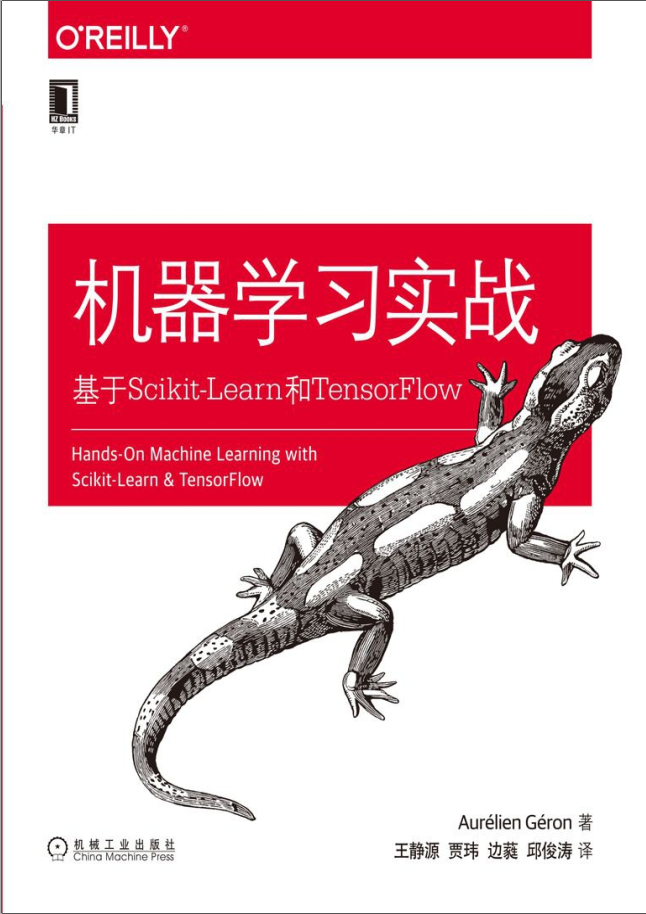

# 机器学习实战： 基于Scikit-Learn和TensorFlow
- 机器学习刷书记录，计划每天一章，争取暑假结束前刷完
- 刷完第一部分后开始做第一部分后面的练习，总结巩固
- 第二部分刷完同样完成书后面的练习
- 刷完后要求能搞懂机器学习所有算法
>1. 能够自己写原生算法
>2. 会调用sklearn里的API
- 目录
>1. [第一章 机器学习概览](01.ipynb)
>>介绍机器学习的相关知识
>2. [第二章 端到端的机器学习项目](02.ipynb)
>>完整的演示了一个机器学习项目的过程，包括收集数据、数据预处理、可视化、模型选择训练、模型评估、网格搜索调参以及项目维护
>3. [第三章 分类](03.ipynb)
>>以NIMIST数据集为基础演示实现二元分类、多类别分类、多标签分类、多输出分类，用到的模型有<mark>随机梯度下降分类器</mark>、<mark>随机森林分类器</mark>，以及穿插了一些评估的相关模块
>4. [第四章 训练模型](04训练模型.ipynb)
>>深入学习回归模型的理论知识，包括线性回归的标准方程、梯度下降、多项式回归、逻辑回归、岭回归、Lasso回归、弹性网络、Softmax回归等
